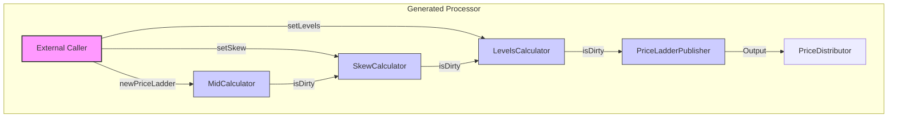

# Fluxtion AOT Compilation Example: Price Ladder Processor

This document demonstrates the transformation of annotated Java classes into a deterministic, AOT-compiled event processor using Fluxtion. It highlights the concept of "Exported Services," where the generated processor implements service interfaces defined in the node graph, allowing external systems to interact with the internal state of the processor in a type-safe manner.

## 1. Source Nodes and Annotations

The example uses a chain of calculators to process a `PriceLadder`. The data flows from `MidCalculator` -> `SkewCalculator` -> `LevelsCalculator` -> `PriceLadderPublisher`.

### 1.1. The Service Interface
The `PriceCalculator` interface defines methods to control the pricing logic.

```java
public interface PriceCalculator {
    default void setSkew(int skew){}
    default void setLevels(int maxLevels){}
    default void setPriceDistributor(PriceDistributor priceDistributor){}
}
```

### 1.2. Annotated Nodes
Nodes implement this interface and are annotated with `@ExportService`. This tells the Fluxtion compiler to expose these methods on the generated container class.

**MidCalculator (Root Node):**
Receives the initial price ladder.
```java
public class MidCalculator implements @ExportService PriceLadderConsumer {
    // ... state ...
    @Override
    public boolean newPriceLadder(PriceLadder priceLadder) {
        // ... calculation logic ...
        return true; // Return true to propagate change
    }
    // ... getters ...
}
```

**SkewCalculator:**
Applies a skew to the price. It depends on `MidCalculator`.
```java
public class SkewCalculator implements @ExportService(propagate = false) PriceCalculator {
    private final MidCalculator midCalculator;
    // ...
    @Override
    public void setSkew(int skew) {
        this.skew = skew;
    }

    @OnTrigger
    public boolean calculateSkewedLadder(){
        // ... logic using midCalculator.getPriceLadder() ...
        return true;
    }
}
```

**LevelsCalculator:**
Filters the number of levels. Depends on `SkewCalculator`.
```java
public class LevelsCalculator implements @ExportService(propagate = false) PriceCalculator {
    private final SkewCalculator SkewCalculator;
    // ...
    @Override
    public void setLevels(int maxLevels) {
        this.maxLevels = maxLevels;
    }

    @OnTrigger
    public boolean calculateLevelsForLadder(){
        // ... logic ...
        return true;
    }
}
```

## 2. AOT Compilation Process

The `GenerateProcessorsAot` class triggers the compilation. It discovers the graph starting from `PriceLadderPublisher` (which pulls in the other calculators via constructor injection).

```java
Fluxtion.compileAot(
    "com.telamin.fluxtion.example.compile.aot.generated",
    "PriceLadderProcessor",
    new PriceLadderPublisher() // The root of the dependency graph
);
```

The compiler:
1.  **Builds the Graph:** Analyzes dependencies (e.g., `LevelsCalculator` needs `SkewCalculator`).
2.  **Topological Sort:** Determines the correct execution order (`Mid` -> `Skew` -> `Levels` -> `Publisher`).
3.  **Service Aggregation:** Identifies all `@ExportService` interfaces (`PriceCalculator`, `PriceLadderConsumer`).
4.  **Code Generation:** Produces the `PriceLadderProcessor` class.

## 3. Generated Code (Intermediate Representation)

The generated `PriceLadderProcessor` acts as a container and dispatcher. It implements the exported interfaces and manages the lifecycle and execution of the nodes.

### 3.1. Class Definition and Fields
The generated class implements the service interfaces found in the graph.

```java
public class PriceLadderProcessor implements 
        CloneableDataFlow<PriceLadderProcessor>,
        @ExportService PriceCalculator,      // <--- Exported Service
        @ExportService PriceLadderConsumer,  // <--- Exported Service
        DataFlow, InternalEventProcessor, BatchHandler {

    // Hard-coded, topologically sorted fields
    private final transient MidCalculator midCalculator_3 = new MidCalculator();
    private final transient SkewCalculator skewCalculator_2 = new SkewCalculator(midCalculator_3);
    private final transient LevelsCalculator levelsCalculator_1 = new LevelsCalculator(skewCalculator_2);
    private final transient PriceLadderPublisher priceLadderPublisher_0 = new PriceLadderPublisher(levelsCalculator_1);
    
    // Dirty flags for change propagation
    private boolean isDirty_levelsCalculator_1 = false;
    private boolean isDirty_midCalculator_3 = false;
    private boolean isDirty_skewCalculator_2 = false;
    
    // ...
}
```

### 3.2. Exported Service Implementation
The generated methods delegate to the specific nodes that implemented the interface. Notice how `setSkew` updates the specific node and then marks it as dirty to trigger downstream processing.

```java
    @Override
    public void setSkew(int arg0) {
        beforeServiceCall("...setSkew...");
        
        // 1. Update the specific node
        isDirty_skewCalculator_2 = true;
        skewCalculator_2.setSkew(arg0);
        
        // 2. Update other nodes that might listen to this (if any)
        isDirty_levelsCalculator_1 = true;
        levelsCalculator_1.setSkew(arg0);
        priceLadderPublisher_0.setSkew(arg0);
        
        // 3. Trigger the propagation loop
        afterServiceCall();
    }
```

### 3.3. Event Processing (The "newPriceLadder" entry point)
This method corresponds to the `PriceLadderConsumer` interface. It shows the deterministic execution path: `Mid` -> `Skew` -> `Levels` -> `Publisher`.

```java
    @Override
    public boolean newPriceLadder(PriceLadder arg0) {
        beforeServiceCall("...newPriceLadder...");
        
        // 1. Root Node Execution
        isDirty_midCalculator_3 = midCalculator_3.newPriceLadder(arg0);
        
        // 2. Dependent: SkewCalculator (Guarded by dirty flag)
        if (guardCheck_skewCalculator_2()) {
            isDirty_skewCalculator_2 = skewCalculator_2.calculateSkewedLadder();
        }
        
        // 3. Dependent: LevelsCalculator
        if (guardCheck_levelsCalculator_1()) {
            isDirty_levelsCalculator_1 = levelsCalculator_1.calculateLevelsForLadder();
        }
        
        // 4. Dependent: Publisher
        if (guardCheck_priceLadderPublisher_0()) {
            priceLadderPublisher_0.publishPriceLadder();
        }
        
        afterServiceCall();
        return true;
    }
    
    // Guard check example: Skew runs if Mid changed
    private boolean guardCheck_skewCalculator_2() {
        return isDirty_midCalculator_3;
    }
```

## 4. Data Flow Diagram

The following diagram illustrates the flow of data and control within the generated processor.


