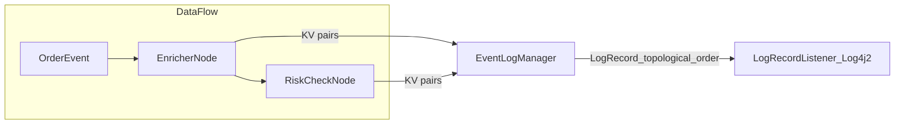

# Audit Logging Demo

This sample demonstrates structured audit logging with Fluxtion’s EventLogger. It shows how nodes log key/value pairs that are aggregated into a per-node LogRecord by the EventLogManager, and how these records are emitted in topological order to show the execution path through the graph.

What you will learn:

- How a node becomes an EventLogSource and receives an injected EventLogger
- Structured, machine- and human-readable log records (KV pairs per node)
- Topological ordering of log records and end-to-end tracing
- Configuring the runtime logging pipeline (LogRecordListener) with Log4j2
- Tracing versus logging (trace produces a record per node visited)
- Zero-GC logging model (LogRecord buffers are reused per event)
- How to build using an AOT graph builder (imperative registration) and run the demo

## Project layout

- [EnricherNode.java](src/main/java/com/telamin/fluxtion/example/sampleapps/audit/EnricherNode.java)
- [RiskCheckNode.java](src/main/java/com/telamin/fluxtion/example/sampleapps/audit/RiskCheckNode.java)
- [FailWhenIdNode.java](src/main/java/com/telamin/fluxtion/example/sampleapps/audit/FailWhenIdNode.java)
- [AuditLoggingDemoRunner.java](src/main/java/com/telamin/fluxtion/example/sampleapps/audit/AuditLoggingDemoRunner.java)
- [AuditLoggingAOTGraphBuilder.java](src/main/java/com/telamin/fluxtion/example/sampleapps/audit/AuditLoggingAOTGraphBuilder.java)
- [log4j2.yaml](src/main/resources/log4j2.yaml)
- [start.sh](start.sh) / [stop.sh](stop.sh)

## Structured logging concepts

- Nodes that implement EventLogSource (or extend EventLogNode/NamedBaseNode) are injected with an EventLogger during init.
- Each node writes key/value pairs to its EventLogger during event handling; the EventLogManager aggregates these values into a structured LogRecord keyed by node name.
- The node name used in the LogRecord is the same as the variable name of the node in the generated AOT code (stable identifier).
- Records are emitted in topological order, reflecting the execution path. The structure shows the path; each node’s content shows the detail.
- Configure logging behaviour at build time with EventProcessorConfig.addEventAudit(...) and at runtime with DataFlow#setAuditXXXX methods (see DataFlow#setAuditLogProcessor, setAuditLogLevel, setAuditTimeFormatter, etc.).

Mermaid sketch of dataflow and logging path:



Zero-GC note: The logging framework reuses LogRecord buffers per event process cycle. After processing completes, the buffers are reset and recycled. This eliminates per-event allocations for logging.

## Code snippets

Enricher node writing KV pairs (matches the current source):

```java
public class EnricherNode extends NamedBaseNode {

    private EnrichedOrder lastEnriched;

    @OnEventHandler
    public void onOrder(OrderEvent order) {
        double notional = order.qty() * order.price();
        lastEnriched = new EnrichedOrder(order, notional);
        // Structured logging: node-local KV pairs aggregated by EventLogManager
        auditLog.info("event", order.toString())
                .debug("calc", "enrich")
                .info("symbol", order.symbol())
                .info("notional", String.valueOf(notional))
                .info("enrichedNotional", lastEnriched.notional);
    }
}
```

Attach a LogRecordListener at runtime using Log4j2:

```
Logger logger = LogManager.getLogger("dataflow.order");
// Emit the structured record via Log4j2
df.setAuditLogProcessor(logger::info);
// Optional: customize timestamp format used in records
df.setAuditTimeFormatter((sb, epochMillis) ->
        sb.append(DateTimeFormatter.ISO_OFFSET_DATE_TIME
                .format(Instant.ofEpochMilli(epochMillis)
                        .atZone(ZoneId.systemDefault()))));
```

Tracing vs logging:

- Logging at INFO/DEBUG/WARN/ERROR only produces records for nodes that actually log KV pairs (via EventLogger.info/debug/etc.).
- Tracing at TRACE produces a record for every node visited in the execution cycle, even if that node did not write any KV pairs.
- Switch level at runtime:

```
df.setAuditLogLevel(EventLogControlEvent.LogLevel.TRACE);
```

## AOT: Imperative builder usage (generation moved to builder)

Do not use the functional DataFlow API for AOT graph builders. Instead, register nodes and auditors imperatively in the builder. Generation of the DataFlow has been moved to [AuditLoggingAOTGraphBuilder.java](src/main/java/com/telamin/fluxtion/example/sampleapps/audit/AuditLoggingAOTGraphBuilder.java).

Builder excerpt (matches current code):

```java
public class AuditLoggingAOTGraphBuilder implements FluxtionGraphBuilder {
    @Override
    public void buildGraph(EventProcessorConfig processorConfig) {
        EnricherNode enricher = new EnricherNode();
        RiskCheckNode risk = new RiskCheckNode(enricher);
        FailWhenIdNode failer = new FailWhenIdNode("FAIL");

        // set instance names to make logs easier to read
        enricher.setName("enricher");
        risk.setName("riskChecker");
        failer.setName("simulatedFailer");

        processorConfig.addNode(enricher);
        processorConfig.addNode(risk);
        processorConfig.addNode(failer);
        // Add an event audit logger so EventLogger records are produced
        processorConfig.addEventAudit();
    }
    @Override
    public void configureGeneration(FluxtionCompilerConfig cfg) {
        cfg.setClassName("AuditLoggingProcessor");
        cfg.setPackageName("com.telamin.fluxtion.example.sampleapps.audit.generated");
    }
}
```

Runtime runner class (excerpt from the actual source):

```java
@Log4j2
public class AuditLoggingDemoRunner {

    public static void main(String[] args) throws Exception {
        // Generation has been moved to AuditLoggingAOTGraphBuilder; this runner just runs the generated processor
        DataFlow df = new AuditLoggingProcessor();

        // Send audit logs to Log4j2
        Logger logger = LogManager.getLogger("dataflow.order");
        df.setAuditLogProcessor(logger::info);

        // Optional: human-readable ISO timestamp formatter
        df.setAuditTimeFormatter((sb, epochMillis) ->
                sb.append(DateTimeFormatter.ISO_OFFSET_DATE_TIME
                        .format(Instant.ofEpochMilli(epochMillis).atZone(ZoneId.systemDefault()))));

        // Drive some events and demonstrate exception handling + last audit record recovery
        try {
            df.onEvent(new OrderEvent("o1", "AAPL", 100, 210.50));
            df.onEvent(new OrderEvent("o2", "MSFT", 5000, 320.10));
            // This one triggers FailWhenIdNode to throw
            df.onEvent(new OrderEvent("FAIL", "TSLA", 1, 1000.00));
        } catch (Throwable e) {
            log.error("Exception processing FAIL: {}", String.valueOf(e));
            log.error("Last audit record (partial):\n{}", df.getLastAuditLogRecord());
        }
    }
}
```

### Failure and recovery logging (getLastAuditLogRecord)

We add a small node [FailWhenIdNode](src/main/java/com/telamin/fluxtion/example/sampleapps/audit/FailWhenIdNode.java) that deliberately throws for a particular OrderEvent id ("FAIL"). In the DemoRunner we wrap df.onEvent(...) in try/catch. If an exception occurs, we print df.getLastAuditLogRecord(), which returns the last partial structured record collected so far. This is useful for diagnosing failures mid-cycle without separate tracing.

## Actual output (captured from ./start.sh on 2025-10-10)

```
12:28:20.575 [main] INFO  dataflow.order - eventLogRecord:
    eventTime: 2025-10-10T12:28:20.572+01:00
    logTime: 2025-10-10T12:28:20.572+01:00
    groupingId: null
    event: OrderEvent
    eventToString: OrderEvent{id='o1', symbol='AAPL', qty=100, price=210.5}
    thread: main
    nodeLogs:
        - enricher: { event: OrderEvent{id='o1', symbol='AAPL', qty=100, price=210.5}, symbol: AAPL, notional: 21050.0, enrichedNotional: 21050.0}
        - riskChecker: { calc: risk, orderId: o1, notional: 21050.0, limit.ok: true}
        - simulatedFailer: { calc: fail-check, orderId: o1}
    endTime: 2025-10-10T12:28:20.573+01:00
12:28:20.575 [main] INFO  dataflow.order - eventLogRecord:
    eventTime: 2025-10-10T12:28:20.575+01:00
    logTime: 2025-10-10T12:28:20.575+01:00
    groupingId: null
    event: OrderEvent
    eventToString: OrderEvent{id='o2', symbol='MSFT', qty=5000, price=320.1}
    thread: main
    nodeLogs:
        - enricher: { event: OrderEvent{id='o2', symbol='MSFT', qty=5000, price=320.1}, symbol: MSFT, notional: 1600500.0, enrichedNotional: 1600500.0}
        - riskChecker: { calc: risk, orderId: o2, notional: 1600500.0, limit.ok: false}
        - simulatedFailer: { calc: fail-check, orderId: o2}
    endTime: 2025-10-10T12:28:20.575+01:00
12:28:20.577 [main] ERROR com.telamin.fluxtion.example.sampleapps.audit.AuditLoggingDemoRunner - Exception processing FAIL: java.lang.RuntimeException: Simulated processing failure for order id=FAIL
12:28:20.577 [main] ERROR com.telamin.fluxtion.example.sampleapps.audit.AuditLoggingDemoRunner - Last audit record (partial):
eventLogRecord:
    eventTime: 2025-10-10T12:28:20.575+01:00
    logTime: 2025-10-10T12:28:20.576+01:00
    groupingId: null
    event: OrderEvent
    eventToString: OrderEvent{id='FAIL', symbol='TSLA', qty=1, price=1000.0}
    thread: main
    nodeLogs:
        - enricher: { event: OrderEvent{id='FAIL', symbol='TSLA', qty=1, price=1000.0}, symbol: TSLA, notional: 1000.0, enrichedNotional: 1000.0}
        - riskChecker: { calc: risk, orderId: FAIL, notional: 1000.0, limit.ok: true}
        - simulatedFailer: { calc: fail-check, orderId: FAIL, failure: triggering simulated exception
```

## Run

From this module directory:

```
./start.sh
```

Or via Maven (ensure log4j2.yaml is on the classpath and system properties are set):

```
mvn -q -DskipTests exec:java -Dexec.mainClass=com.telamin.fluxtion.example.sampleapps.audit.AuditLoggingDemoRunner \
  -Dlog4j.configurationFile=src/main/resources/log4j2.yaml \
  -Djava.util.logging.manager=org.apache.logging.log4j.jul.LogManager
```

## References

- Examples of audit logging: fluxtion-compiler/fluxtion-full-compiler/src/test/java/com/fluxtion/dataflow/node/audit
- Runtime configuration methods: com.telamin.fluxtion.runtime.DataFlow#setAuditXXXXXX
- EventLogger, EventLogSource, LogRecord, LogRecordListener APIs
