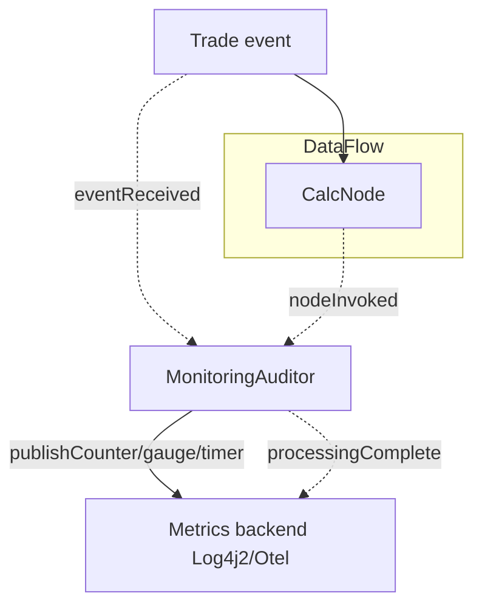

# Auditor Monitoring Demo

This sample shows how to monitor a DataFlow using the Auditing framework. It demonstrates:

- Implementing a custom Auditor (implements com.telamin.fluxtion.runtime.audit.Auditor)
- Tracking per-node invocation counts and per-event latency
- Publishing metrics to an external monitoring service (a simple OpenTelemetry-like publisher backed by Log4j2)
- Adding the auditor via EventProcessorConfig in an AOT graph builder (imperative builder)

Important: This demo focuses on auditors as general-purpose monitoring hooks. Auditors are not limited to logging; they can emit metrics, perform persistence, profiling, external notifications, and more.

## Project layout

- [MonitoringAuditor.java](src/main/java/com/telamin/fluxtion/example/sampleapps/auditmon/MonitoringAuditor.java)
- [SimpleOtelPublisher.java](src/main/java/com/telamin/fluxtion/example/sampleapps/auditmon/SimpleOtelPublisher.java)
- [AuditorMonitoringDemoRunner.java](src/main/java/com/telamin/fluxtion/example/sampleapps/auditmon/AuditorMonitoringDemoRunner.java)
- [AuditorMonitoringAOTGraphBuilder.java](src/main/java/com/telamin/fluxtion/example/sampleapps/auditmon/AuditorMonitoringAOTGraphBuilder.java)

## How it works

- MonitoringAuditor implements Auditor and receives callbacks for:
  - nodeRegistered: each node added to the graph during init
  - eventReceived: before any node processes the event
  - nodeInvoked: for each node visited on the execution path (auditInvocations returns true)
  - processingComplete: after the event finishes processing
- The auditor updates counters and measures per-event latency (micros) and publishes to a MonitoringPublisher.
- SimpleOtelPublisher is a tiny adapter that prints "otel.*" lines via Log4j2.

## Running (generation moved to AOT builder)

The DataFlow class is generated by the AOT builder. The demo runner simply instantiates the generated processor and drives events.

Runner (excerpt from the actual source):

```java
public class AuditorMonitoringDemoRunner {

    public static void main(String[] args) throws Exception {
        DataFlow df = new AuditorMonitoringProcessor();
        df.init();

        // Drive some events
        df.onEvent(new Trade("t1", "AAPL", 100, 210.5));
        df.onEvent(new Trade("t2", "MSFT", 250, 320.1));
        df.onEvent(new Trade("t3", "NVDA", 10, 950.0));
    }
}
```

The AOT builder registers the calculation node and the MonitoringAuditor and enables event auditing. See the source here: [AuditorMonitoringAOTGraphBuilder.java](src/main/java/com/telamin/fluxtion/example/sampleapps/auditmon/AuditorMonitoringAOTGraphBuilder.java).

## Where the auditor fits in the processing loop



## Actual output (from running ./start.sh on 2025-10-10)

Captured on our run (values will vary):

```
12:35:29.707 [main] INFO  com.telamin.fluxtion.example.sampleapps.auditmon.SimpleOtelPublisher - otel.counter name=node.registered value=1
12:35:29.708 [main] INFO  com.telamin.fluxtion.example.sampleapps.auditmon.SimpleOtelPublisher - otel.counter name=node.registered value=1
12:35:29.708 [main] INFO  com.telamin.fluxtion.example.sampleapps.auditmon.SimpleOtelPublisher - otel.counter name=node.registered value=1
12:35:29.708 [main] INFO  com.telamin.fluxtion.example.sampleapps.auditmon.SimpleOtelPublisher - otel.counter name=node.registered value=1
12:35:29.717 [main] INFO  com.telamin.fluxtion.example.sampleapps.auditmon.SimpleOtelPublisher - otel.timer name=event.duration.micros micros=138588648355
12:35:29.717 [main] INFO  com.telamin.fluxtion.example.sampleapps.auditmon.SimpleOtelPublisher - otel.gauge name=invocations.subscriptionManager value=0.0
12:35:29.717 [main] INFO  com.telamin.fluxtion.example.sampleapps.auditmon.SimpleOtelPublisher - otel.gauge name=invocations.callbackDispatcher value=0.0
12:35:29.717 [main] INFO  com.telamin.fluxtion.example.sampleapps.auditmon.SimpleOtelPublisher - otel.gauge name=invocations.context value=0.0
12:35:29.717 [main] INFO  com.telamin.fluxtion.example.sampleapps.auditmon.SimpleOtelPublisher - otel.gauge name=invocations.calcNode_0 value=0.0
12:35:29.723 [main] INFO  com.telamin.fluxtion.example.sampleapps.auditmon.SimpleOtelPublisher - otel.counter name=node.invoked.calcNode_0 value=1
12:35:29.723 [main] INFO  com.telamin.fluxtion.example.sampleapps.auditmon.SimpleOtelPublisher - otel.timer name=event.duration.micros micros=138588654601
12:35:29.723 [main] INFO  com.telamin.fluxtion.example.sampleapps.auditmon.SimpleOtelPublisher - otel.gauge name=invocations.subscriptionManager value=0.0
12:35:29.723 [main] INFO  com.telamin.fluxtion.example.sampleapps.auditmon.SimpleOtelPublisher - otel.gauge name=invocations.callbackDispatcher value=0.0
12:35:29.723 [main] INFO  com.telamin.fluxtion.example.sampleapps.auditmon.SimpleOtelPublisher - otel.gauge name=invocations.context value=0.0
12:35:29.723 [main] INFO  com.telamin.fluxtion.example.sampleapps.auditmon.SimpleOtelPublisher - otel.gauge name=invocations.calcNode_0 value=1.0
12:35:29.723 [main] INFO  com.telamin.fluxtion.example.sampleapps.auditmon.SimpleOtelPublisher - otel.counter name=node.invoked.calcNode_0 value=1
12:35:29.725 [main] INFO  com.telamin.fluxtion.example.sampleapps.auditmon.SimpleOtelPublisher - otel.timer name=event.duration.micros micros=138588657161
12:35:29.725 [main] INFO  com.telamin.fluxtion.example.sampleapps.auditmon.SimpleOtelPublisher - otel.gauge name=invocations.subscriptionManager value=0.0
12:35:29.725 [main] INFO  com.telamin.fluxtion.example.sampleapps.auditmon.SimpleOtelPublisher - otel.gauge name=invocations.callbackDispatcher value=0.0
12:35:29.725 [main] INFO  com.telamin.fluxtion.example.sampleapps.auditmon.SimpleOtelPublisher - otel.gauge name=invocations.context value=0.0
12:35:29.725 [main] INFO  com.telamin.fluxtion.example.sampleapps.auditmon.SimpleOtelPublisher - otel.gauge name=invocations.calcNode_0 value=2.0
12:35:29.726 [main] INFO  com.telamin.fluxtion.example.sampleapps.auditmon.SimpleOtelPublisher - otel.counter name=node.invoked.calcNode_0 value=1
12:35:29.726 [main] INFO  com.telamin.fluxtion.example.sampleapps.auditmon.SimpleOtelPublisher - otel.timer name=event.duration.micros micros=138588657439
12:35:29.726 [main] INFO  com.telamin.fluxtion.example.sampleapps.auditmon.SimpleOtelPublisher - otel.gauge name=invocations.subscriptionManager value=0.0
12:35:29.726 [main] INFO  com.telamin.fluxtion.example.sampleapps.auditmon.SimpleOtelPublisher - otel.gauge name=invocations.callbackDispatcher value=0.0
12:35:29.726 [main] INFO  com.telamin.fluxtion.example.sampleapps.auditmon.SimpleOtelPublisher - otel.gauge name=invocations.context value=0.0
12:35:29.726 [main] INFO  com.telamin.fluxtion.example.sampleapps.auditmon.SimpleOtelPublisher - otel.gauge name=invocations.calcNode_0 value=3.0
```

## Why auditors?

- General-purpose monitoring: capture metrics (counters, timers, gauges) per node or per event.
- System integration: forward measurements to external tools (OpenTelemetry exporters, Prometheus pushgateway, statsd, custom HTTP services).
- Rich lifecycle view: with auditInvocations() = true, receive callbacks for every node visited (tracing-like visibility) regardless of structured logging.
- SLOs and alerts: emit counters and latency histograms for alerting; track error rates and slow paths.
- Persistence and replay: implement auditors that persist state or write replayable YAML/JSON traces for reproducibility.
- Profiling and diagnostics: build auditors to measure per-node timings, hotspots, and call sequences.
- Auditors can also be nodes, receiving services and injections just like any other component.

## Run

From the module directory:

```
./start.sh
```

Or via Maven:

```
mvn -q -DskipTests exec:java -Dexec.mainClass=com.telamin.fluxtion.example.sampleapps.auditmon.AuditorMonitoringDemoRunner \
  -Dlog4j.configurationFile=src/main/resources/log4j2.yaml \
  -Djava.util.logging.manager=org.apache.logging.log4j.jul.LogManager
```

## References

- com.fluxtion.dataflow.node.audit.RegistrationListenerTest and MyNodeAudit example
- com.fluxtion.dataflow.replay.YamlReplayRecordWriter (itself an Auditor)
- DataFlow audit configuration methods: com.telamin.fluxtion.runtime.DataFlow#setAuditXXXXXX
