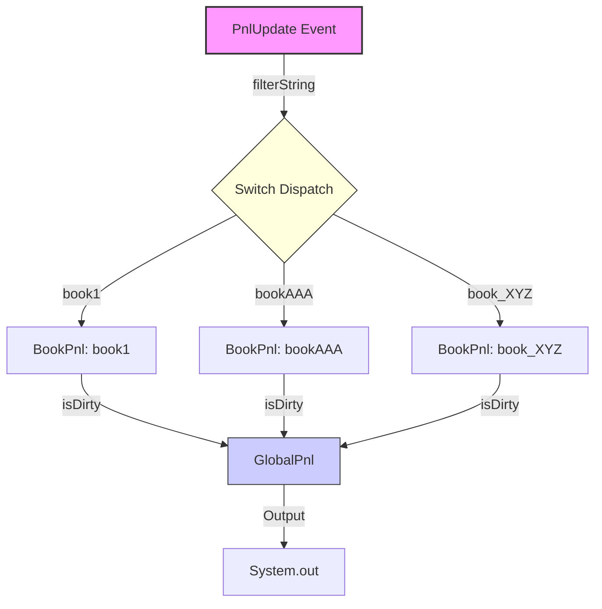

# Fluxtion Replay & Filtered Event Handling Example: Global PnL

This document demonstrates how Fluxtion handles strongly-typed events with filtering, AOT compilation, and event replay capabilities. It focuses on a `GlobalPnl` calculator that aggregates Profit and Loss (PnL) from multiple `BookPnl` nodes, where each book node subscribes to updates for a specific book name.

## 1. Source Nodes and Annotations

The example consists of `BookPnl` nodes that track individual book values and a `GlobalPnl` node that sums them up.

### 1.1. The Event: PnlUpdate
The event is a POJO that implements the `Event` interface. It provides a `filterString()` method used for routing.

```java
@Data
public class PnlUpdate implements Event {
    String bookName;
    int amount;

    @Override
    public String filterString() {
        return bookName;
    }
}
```

### 1.2. Filtered Event Handler: BookPnl
The `BookPnl` class uses `@OnEventHandler` with a `filterVariable`. This tells Fluxtion to only deliver `PnlUpdate` events where `event.filterString()` matches the value of the `bookName` field in this instance.

```java
@RequiredArgsConstructor
public class BookPnl implements NamedNode {
    private final String bookName; // Acts as the filter value
    private transient int pnl;

    @OnEventHandler(filterVariable = "bookName")
    public boolean pnlUpdate(PnlUpdate pnlUpdate) {
        pnl = pnlUpdate.getAmount();
        return true; // Return true to signal state change
    }
    // ...
}
```

### 1.3. Aggregator: GlobalPnl
The `GlobalPnl` node depends on a list of `BookPnl` nodes. It recalculates the total whenever any of its dependencies change (signaled by the `true` return value in `BookPnl.pnlUpdate`).

```java
public class GlobalPnl implements NamedNode {
    // ...
    @OnTrigger
    public boolean calculate() {
        int pnl = bookPnlList.stream().mapToInt(BookPnl::getPnl).sum();
        System.out.println(time + "," + pnl);
        return true;
    }
}
```

## 2. AOT Compilation and Graph Construction

The `GlobalPnlAOTGraphBuilder` defines the specific topology for this application and triggers the AOT compilation process.

### 2.1. Graph Definition
It creates three distinct `BookPnl` instances, each filtering for a different book name, and injects them into the `GlobalPnl` node.

```java
    @Override
    public void buildGraph(EventProcessorConfig processorConfig) {
        processorConfig.addNode(
                new GlobalPnl(Arrays.asList(
                        new BookPnl("book1"),
                        new BookPnl("bookAAA"),
                        new BookPnl("book_XYZ")
                ))
        );
        // ... auditor configuration ...
    }
```

### 2.2. Triggering Compilation
The `main` method invokes `Fluxtion.compile`, passing the graph builder and configuration. This is where the compiler analyzes the graph, resolves dependencies, and generates the source code for the `GlobalPnlProcessor`.

```java
    public static void main(String[] args) {
        GlobalPnlAOTGraphBuilder builder = new GlobalPnlAOTGraphBuilder();
        // Triggers the AOT compilation
        Fluxtion.compile(builder::buildGraph, builder::configureGeneration);
    }

    @Override
    public void configureGeneration(FluxtionCompilerConfig compilerConfig) {
        // Specifies the name and package of the generated class
        compilerConfig.setClassName("GlobalPnlProcessor");
        compilerConfig.setPackageName("com.telamin.fluxtion.example.compile.replay.replay.generated");
    }
```

When this runs, Fluxtion generates the `GlobalPnlProcessor` class (shown in the next section) which hard-codes this structure and the routing logic.

## 3. Generated Code (Intermediate Representation)

The generated `GlobalPnlProcessor` contains optimized dispatch logic. Instead of iterating through listeners at runtime, it uses a `switch` statement on the event's filter string to directly invoke the correct handler.

### 3.1. Optimized Dispatch Logic
The `handleEvent` method demonstrates the "Stringly Typed" dispatch.

```java
  public void handleEvent(PnlUpdate typedEvent) {
    auditEvent(typedEvent);
    switch (typedEvent.filterString()) {
        // Filter: "book1" -> Route to bookPnl_book1
      case ("book1"):
        handle_PnlUpdate_book1(typedEvent);
        afterEvent();
        return;
        // Filter: "bookAAA" -> Route to bookPnl_bookAAA
      case ("bookAAA"):
        handle_PnlUpdate_bookAAA(typedEvent);
        afterEvent();
        return;
        // ...
    }
    afterEvent();
  }
```

### 3.2. Propagation and Dirty Flags
When a specific handler is invoked, it updates the node and sets a dirty flag. The processor then checks if dependent nodes (like `GlobalPnl`) need to run.

```java
  private void handle_PnlUpdate_book1(PnlUpdate typedEvent) {
    // 1. Invoke the specific node handler
    isDirty_bookPnl_book1 = bookPnl_book1.pnlUpdate(typedEvent);
    
    // 2. Check if GlobalPnl needs to run (Guard Check)
    if (guardCheck_globalPnl()) {
      globalPnl.calculate();
    }
  }

  // Guard check: GlobalPnl runs if ANY of its books changed
  private boolean guardCheck_globalPnl() {
    return isDirty_bookPnl_book1
        | isDirty_bookPnl_bookAAA
        | isDirty_bookPnl_book_XYZ
        | isDirty_clock;
  }
```

## 4. Execution and Replay

The `GeneraEventLogMain` class demonstrates how to run the processor, capture events, and replay them.

```java
    // 1. Normal Execution
    globalPnlProcessor.onEvent(new PnlUpdate("book1", 200));
    
    // 2. Replay
    YamlReplayRunner.newSession(new StringReader(eventLog), new GlobalPnlProcessor())
            .runReplay();
```

Because the generated processor is deterministic, replaying the same log of events will result in the exact same internal state transitions and outputs.

## 5. Data Flow Diagram

The following diagram illustrates the filtered event routing and subsequent aggregation.


