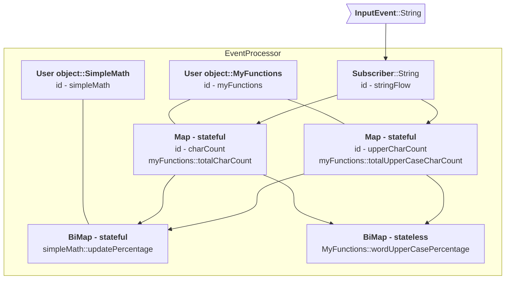

#  DataFlow
---
A DataFlow is a live structure where new events trigger a set of dispatch operations. We create a DataFlow with:

```java
DataFlowBuilder.[subscribe operation].build()
```


### Subscribe to event

To create a flow for String events, call  `DataFlowBuilder.subscribe(String.class)`, any call to processor.onEvent("myString") will be 
routed to this flow.

```java
DataFlow.subscribe(String.class)
```

Once a flow has been created map, filter, groupBy, etc. functions can be applied as chained calls.

```java
public static void main(String[] args) {
    DataFlow processor = DataFlowBuilder.subscribe(String.class)
            .console("string in {}")
            .build();

    processor.onEvent("AAA");
    processor.onEvent("BBB");
}
```

Running the example code above logs to console

```console
string in AAA
string in BBB
```

###Map
A map operation takes the output from a parent node and then applies a function to it. If the return of the
function is null then the event notification no longer propagates down that path.

```java
DataFlow.subscribe(String.class);
    .map(String::toLowerCase);
```

**Map supports**

- Stateless functions
- Stateful functions
- Primitive specialisation
- Method references

```java
public static void main(String[] args) {
    DataFlow processor = DataFlowBuilder.subscribe(String.class)
            .map(String::toLowerCase)
            .console("string in {}")
            .build();

    processor.onEvent("AAA");
    processor.onEvent("BBB");
}
```

Running the example code above logs to console

```console
string mapped aaa
string mapped bbb
```

###BiMap
Two data flows can be mapped with a bi map function. Both flows must have triggered at least once for the bimap function
to be invoked

```java
public static void main(String[] args) {
    var strings = DataFlowBuilder.subscribe(String.class);
    var ints = DataFlowBuilder.subscribe(Integer.class);
    DataFlow processor = DataFlowBuilder.mapBiFunction((a, b) -> Integer.parseInt(a) + b, strings, ints)
            .console("biMap ans: {}")
            .build();

    processor.onEvent("500");
    processor.onEvent(55);
}
```

Running the example code above logs to console

```console
biMap ans: 555
```

###Default value
A default value can be assigned to any flow. This can be useful when calculating a bi map function and one data flow
argument is optional

```java
public static void main(String[] args) {
    var strings = DataFlowBuilder.subscribe(String.class).defaultValue("200");
    var ints = DataFlowBuilder.subscribe(Integer.class);
    DataFlow processor = DataFlowBuilder.mapBiFunction((a, b) -> Integer.parseInt(a) + b, strings, ints)
            .console("biMap with default value ans: {}")
            .build();
    processor.onEvent(55);
}
```

Running the example code above logs to console

```console
biMap with default value ans: 255
```

###Filter
A filter predicate can be applied to a node to control event propagation, true continues the propagation and false swallows
the notification. If the predicate returns true then the input to the predicate is passed to the next operation in the
event processor.

```java
DataFlow.subscribe(Integer.class)
    .filter(i -> i > 10)
```

**Filter supports**

- Stateless functions
- Stateful functions
- Primitive specialisation
- Method references
- Inline lambdas - **interpreted mode only support, AOT mode will not serialise the inline lambda**

```java
public static void main(String[] args) {
    DataFlow processor = DataFlowBuilder.subscribe(Integer.class)
            .filter(i -> i > 10)
            .console("int {} > 10 ")
            .build();

    processor.onEvent(1);
    processor.onEvent(17);
    processor.onEvent(4);
}
```

Running the example code above logs to console

```console
int 17 > 10
```

###Reduce
There is no reduce function required in Fluxtion, stateful map functions perform the role of reduce. In a classic batch
environment the reduce operation combines a collection of items into a single value. In a streaming environment
the set of values is never complete, we can view the current value of a stateful map operation which is equivalent to the
reduce operation. The question is rather, when is the value of the stateful map published and reset.

###FlatMap

A Flatmap operation flattens a collection in a data flow. Any operations applied after the flatmap operation are 
performed on each element in the collection. 

```java
public static void main(String[] args) {
    DataFlow processor = DataFlowBuilder.subscribe(String.class)
            .console("\ncsv in [{}]")
            .flatMap(s -> Arrays.asList(s.split(",")))
            .console("flattened item [{}]")
            .build();

    processor.onEvent("A,B,C");
    processor.onEvent("2,3,5,7,11");
}
```

Arrays can be flattened with:


`[data flow].flatMapFromArray(Function<T, R[]> iterableFunction)`


Running the example code above logs to console

```console
csv in [A,B,C]
flattened item [A]
flattened item [B]
flattened item [C]

csv in [2,3,5,7,11]
flattened item [2]
flattened item [3]
flattened item [5]
flattened item [7]
flattened item [11]
```

###Merge flows
Flows can be merged to output a single flow that can be operated on

```java
public static void main(String[] args) {
    DataFlow processor = DataFlowBuilder.merge(
                    DataFlowBuilder.subscribe(Long.class).console("long : {}"),
                    DataFlowBuilder.subscribe(String.class).console("string : {}").map(Mappers::parseLong),
                    DataFlowBuilder.subscribe(Integer.class).console("int : {}").map(Integer::longValue))
            .console("MERGED FLOW -> {}")
            .build();

    processor.onEvent(1234567890835L);
    processor.onEvent("9994567890835");
    processor.onEvent(123);
}
```

Running the example code above logs to console

```console
long : 1234567890835
MERGED FLOW -> 1234567890835
string : 9994567890835
MERGED FLOW -> 9994567890835
int : 123
MERGED FLOW -> 123
```

###Merge and map flows

Merge multiple streams of different types into a single output, applying a mapping operation to combine the different types.
Only when at least one element from each required flow is received will the data flow publish. The upstream flows are
merged into a user class that is published as the output of the merge flow. The target class is specified with:

`MergeAndMapFlowBuilder.of(Supplier<T> mergeTargetSupplier)`

Upstream flows are set on the merge target class with a Consumer operation on the target class, T:

`[merge and map builder]<T>.required(DataFlow<F> updstreamFlow, BiConsumer<T, F>)`

Merge inputs are supported that do not have to trigger to publish the flow downstream. The value in the merge target 
could be null if the upstream has not triggered and all the required flows have.

`[merge and map builder]<T>.requiredNoTrigger(DataFlow<F> updstreamFlow, BiConsumer<T, F>)`


```java
public static void main(String[] args) {
    DataFlow processor = MergeAndMapFlowBuilder.of(MyData::new)
            .required(DataFlowBuilder.subscribe(String.class), MyData::setCustomer)
            .required(DataFlowBuilder.subscribe(Date.class), MyData::setDate)
            .required(DataFlowBuilder.subscribe(Integer.class), MyData::setId)
            .dataFlow()
            .console("new customer : {}")
            .build();

    processor.onEvent(new Date());
    processor.onEvent("John Doe");
    //only publishes when the last required flow is received
    processor.onEvent(123);
}

@Data
public static class MyData {
    private String customer;
    private Date date;
    private int id;
}
```

Running the example code above logs to console

```console
new customer : MergeAndMapSample.MyData(customer=John Doe, date=Sat May 11 19:17:11 BST 2024, id=123)
```

###Sink

An application can register for output from the EventProcessor by supplying a consumer to addSink and removed with a 
call to removeSink. Bound classes can publish to sinks during an event process cycle, any registered sinks will see 
the update as soon as the data is published, not at the end of the cycle. 

* Adding sink - `processor.addSink("mySink", (Consumer<T> t) ->{})`
* Removing sink - `processor.removeSink("mySink")`


```java
public static void main(String[] args) {
    DataFlow processor = DataFlowBuilder.subscribeToIntSignal("myIntSignal")
            .mapToObj(d -> "intValue:" + d)
            .sink("mySink")//CREATE A SINK IN THE PROCESSOR
            .build();

    //ADDING SINK CONSUMER
    processor.addSink("mySink", (Consumer<String>) System.out::println);

    processor.publishSignal("myIntSignal", 10);
    processor.publishSignal("myIntSignal", 256);

    //REMOVING SINK CONSUMER
    processor.removeSink("mySink");
    processor.publishSignal("myIntSignal", 512);
}
```

Running the example code above logs to console

```console
intValue:10
intValue:256
```

###DataFlow node lookup by id
DataFlow nodes are available for lookup from an event processor instance using their name. In this case the lookup 
returns a reference to the wrapped value and not the wrapping node. The application can then use the reference to 
pull data from the node without requiring an event process cycle to push data to an output.

When building the graph with DSL a call to `id` makes that element addressable for lookup.

```java

public static void main(String[] args) throws NoSuchFieldException {
    DataFlow processor = DataFlowBuilder.subscribe(String.class)
            .filter(s -> s.equalsIgnoreCase("monday"))
            //ID START - this makes the wrapped value accessible via the id
            .mapToInt(Mappers.count()).id("MondayChecker")
            //ID END
            .console("Monday is triggered")
            .build();

    processor.onEvent("Monday");
    processor.onEvent("Tuesday");
    processor.onEvent("Wednesday");

    //ACCESS THE WRAPPED VALUE BY ITS ID
    Integer mondayCheckerCount = processor.getStreamed("MondayChecker");
    System.out.println("Monday count:" + mondayCheckerCount + "\n");

    //ACCESS THE WRAPPED VALUE BY ITS ID
    processor.onEvent("Monday");
    mondayCheckerCount = processor.getStreamed("MondayChecker");
    System.out.println("Monday count:" + mondayCheckerCount);
}

```

Running the example code above logs to console

```console
Monday is triggered
Monday count:1

Monday is triggered
Monday count:2
```

###Graph of functions
Fluxtion automatically wraps the function in a node, actually a monad, and binds both into the event processor. The wrapping node
handles all the event notifications, invoking the user function when it is triggered. Each wrapping node can be the
head of multiple child flows forming complex graph structures that obey the dispatch rules. This is in contrast to
classic java streams that have a terminal operation and a pipeline structure.

This example creates a simple graph structure, multiple stateful/stateless functions are bound to a single parent DataFlow.

We are using the `DataFlow.console` operation to print intermediate results to the screen for illustrative purposese. 
The console operation is a specialisation of `DataFlow.peek`.

```java
public static void main(String[] args) {
    //STATEFUL FUNCTIONS
    MyFunctions myFunctions = new MyFunctions();

    var stringFlow = DataFlowBuilder.subscribe(String.class).console("input: '{}'");

    var charCount = stringFlow
            .map(myFunctions::totalCharCount)
            .console("charCountAggregate: {}");

    var upperCharCount = stringFlow
            .map(myFunctions::totalUpperCaseCharCount)
            .console("upperCharCountAggregate: {}");

    DataFlowBuilder.mapBiFunction(new SimpleMath()::updatePercentage, upperCharCount, charCount)
            .console("percentage chars upperCase all words:{}");

    //STATELESS FUNCTION
    DataFlow processor = DataFlowBuilder
            .mapBiFunction(MyFunctions::wordUpperCasePercentage,
                    stringFlow.map(MyFunctions::upperCaseCharCount).console("charCourWord:{}"),
                    stringFlow.map(MyFunctions::charCount).console("upperCharCountWord:{}"))
            .console("percentage chars upperCase this word:{}\n")
            .build();

    processor.onEvent("test ME");
    processor.onEvent("and AGAIN");
    processor.onEvent("ALL CAPS");
}
```

Running the above with a strings **'test ME', 'and AGAIN'** outputs

```console
input: 'test ME'
charCountAggregate: 6
upperCharCountAggregate: 2
percentage chars upperCase all words:0.3333333333333333
charCourWord:2
upperCharCountWord:6
percentage chars upperCase this word:0.3333333333333333

input: 'and AGAIN'
charCountAggregate: 14
upperCharCountAggregate: 7
percentage chars upperCase all words:0.45
charCourWord:5
upperCharCountWord:8
percentage chars upperCase this word:0.625

input: 'ALL CAPS'
charCountAggregate: 21
upperCharCountAggregate: 14
percentage chars upperCase all words:0.5609756097560976
charCourWord:7
upperCharCountWord:7
percentage chars upperCase this word:1.0
```

#### Processing graph
Fluxtion DSL only requires the developer to write functions, any wrapping nodes are automatically added to the event processor.
The compiler automatically selects stateful or stateless map functions, binding user instances if a stateful map 
function is specified.



MyFunctions class is a normal java class bound into the event processor.

```java
@Getter
public class MyFunctions {

    private long totalCharCount;
    private long upperCaseCharCount;

    public static long charCount(String s) {
        return s.length();
    }

    public static long upperCaseCharCount(String s) {
        return s.chars().filter(Character::isUpperCase).count();
    }

    public long totalCharCount(String s) {
        totalCharCount += charCount(s);
        return totalCharCount;
    }

    public long totalUpperCaseCharCount(String s) {
        upperCaseCharCount += upperCaseCharCount(s);
        return upperCaseCharCount;
    }

    public static double wordUpperCasePercentage(long longA, long longB) {
        return (double) longA /longB;
    }

    @Getter
    public static class SimpleMath {
        private double a;
        private double b;
        private double percentage;

        public double updatePercentage(long longA, long longB) {
            a += longA;
            b += longB;
            percentage = a / b;
            return percentage;
        }
    }
}
```


## Trigger control
---
Fluxtion offers a way to override the triggering of a flow node in the event processor. There are four trigger controls
available for client code to customise:

* **Flow.publishTrigger** - Notifies a child node when triggered, adds a notification to the normal publish
* **Flow.publishTriggerOverride** - Notifies a child node when triggered, removes all other publish notifications
* **Flow.updateTrigger** - Overrides when the flow node runs its functional operation
* **Flow.resetTrigger** - If the functional operation is stateful calls the reset function

In the trigger examples we are using the `DataFlow.subscribeToSignal` and `processor.publishSignal` to drive the trigger
controls on the flow node.

###PublishTrigger
In this example the publishTrigger control enables multiple publish calls for the flow node. Child notifications are in 
addition to the normal triggering operation of the flow node. The values in the parent node are unchanged when publishing.

`publishTrigger(DataFlow.subscribeToSignal("publishMe"))`

Child DataFlow nodes are notified when publishTrigger fires or the map function executes in a calculation cycle.

```java
public class TriggerPublishSample {
    public static void main(String[] args) {
        DataFlow processor = DataFlowBuilder.subscribeToNode(new SubscribeToNodeSample.MyComplexNode())
                .console("node triggered -> {}")
                .map(SubscribeToNodeSample.MyComplexNode::getIn)
                .aggregate(Collectors.listFactory(4))
                .publishTrigger(DataFlowBuilder.subscribeToSignal("publishMe"))
                .console("last 4 elements:{}")
                .build();

        processor.onEvent("A");
        processor.onEvent("B");
        processor.onEvent("C");
        processor.onEvent("D");
        processor.onEvent("E");
        processor.onEvent("F");

        processor.publishSignal("publishMe");
        processor.publishSignal("publishMe");
        processor.publishSignal("publishMe");
    }
}
```

Running the example code above logs to console
```console
node triggered -> SubscribeToNodeSample.MyComplexNode(in=A)
last 4 elements:[A]
node triggered -> SubscribeToNodeSample.MyComplexNode(in=B)
last 4 elements:[A, B]
node triggered -> SubscribeToNodeSample.MyComplexNode(in=C)
last 4 elements:[A, B, C]
node triggered -> SubscribeToNodeSample.MyComplexNode(in=D)
last 4 elements:[A, B, C, D]
node triggered -> SubscribeToNodeSample.MyComplexNode(in=E)
last 4 elements:[B, C, D, E]
node triggered -> SubscribeToNodeSample.MyComplexNode(in=F)
last 4 elements:[C, D, E, F]
last 4 elements:[C, D, E, F]
last 4 elements:[C, D, E, F]
last 4 elements:[C, D, E, F]

```

###PublishTriggerOverride
In this example the publishTrigger control overrides the normal triggering operation of the flow node. The child is notified
only when publishTriggerOverride fires, changes due to recalculation are swallowed and not published downstream.
The values in the parent node are unchanged when publishing.

`publishTriggerOverride(DataFlow.subscribeToSignal("publishMe"))`

Child DataFlow nodes are notified when publishTriggerOverride fires.

```java
public class TriggerPublishOverrideSample {
    public static void main(String[] args) {
        DataFlow processor = DataFlowBuilder.subscribeToNode(new SubscribeToNodeSample.MyComplexNode())
                .console("node triggered -> {}")
                .map(SubscribeToNodeSample.MyComplexNode::getIn)
                .aggregate(Collectors.listFactory(4))
                .publishTriggerOverride(DataFlowBuilder.subscribeToSignal("publishMe"))
                .console("last 4 elements:{}\n")
                .build();

        processor.onEvent("A");
        processor.onEvent("B");
        processor.onEvent("C");
        processor.onEvent("D");

        processor.publishSignal("publishMe");
        processor.onEvent("E");
        processor.onEvent("F");
        processor.onEvent("G");
        processor.onEvent("H");

        processor.publishSignal("publishMe");
    }
}
```

Running the example code above logs to console

```console
node triggered -> SubscribeToNodeSample.MyComplexNode(in=A)
node triggered -> SubscribeToNodeSample.MyComplexNode(in=B)
node triggered -> SubscribeToNodeSample.MyComplexNode(in=C)
node triggered -> SubscribeToNodeSample.MyComplexNode(in=D)
last 4 elements:[A, B, C, D]

node triggered -> SubscribeToNodeSample.MyComplexNode(in=E)
node triggered -> SubscribeToNodeSample.MyComplexNode(in=F)
node triggered -> SubscribeToNodeSample.MyComplexNode(in=G)
node triggered -> SubscribeToNodeSample.MyComplexNode(in=H)
last 4 elements:[E, F, G, H]
```

###UpdateTrigger
In this example the updateTrigger controls when the functional mapping operation of the flow node is invoked. The values 
are only aggregated when the update trigger is called. Notifications from the parent node are ignored and do not trigger
a mapping operation.

`updateTrigger(DataFlow.subscribeToSignal("updateMe"))`

A map operation only occurs when the update trigger fires. 

```java
public class TriggerUpdateSample {
    public static void main(String[] args) {
        var processor = DataFlowBuilder.subscribeToNode(new SubscribeToNodeSample.MyComplexNode())
                .console("node triggered -> {}")
                .map(SubscribeToNodeSample.MyComplexNode::getIn)
                .aggregate(Collectors.listFactory(4))
                .updateTrigger(DataFlowBuilder.subscribeToSignal("updateMe"))
                .console("last 4 elements:{}\n")
                .build();

        processor.onEvent("A");
        processor.onEvent("B");
        processor.onEvent("C");
        processor.publishSignal("updateMe");

        processor.onEvent("D");
        processor.onEvent("E");
        processor.onEvent("F");
        processor.publishSignal("updateMe");
    }
}
```

Running the example code above logs to console

```console
node triggered -> SubscribeToNodeSample.MyComplexNode(in=A)
node triggered -> SubscribeToNodeSample.MyComplexNode(in=B)
node triggered -> SubscribeToNodeSample.MyComplexNode(in=C)
last 4 elements:[C]

node triggered -> SubscribeToNodeSample.MyComplexNode(in=D)
node triggered -> SubscribeToNodeSample.MyComplexNode(in=E)
node triggered -> SubscribeToNodeSample.MyComplexNode(in=F)
last 4 elements:[C, F]
```

###ResetTrigger
In this example the resetTrigger controls when the functional mapping operation of the flow node is reset. The aggregate
operation is stateful so all the values in the list are removed when then reset trigger fires. The reset operation causes 
trigger a notification to children of the flow node.

`resetTrigger(DataFlow.subscribeToSignal("resetMe"))`

The reset trigger notifies the stateful function to clear its state.

```java
public class TriggerResetSample {
    public static void main(String[] args) {
        DataFlow processor = DataFlowBuilder.subscribeToNode(new SubscribeToNodeSample.MyComplexNode())
                .console("node triggered -> {}")
                .map(SubscribeToNodeSample.MyComplexNode::getIn)
                .aggregate(Collectors.listFactory(4))
                .resetTrigger(DataFlowBuilder.subscribeToSignal("resetMe").console("\n--- resetTrigger ---"))
                .console("last 4 elements:{}")
                .build();

        processor.onEvent("A");
        processor.onEvent("B");
        processor.onEvent("C");
        processor.onEvent("D");

        processor.publishSignal("resetMe");
        processor.onEvent("E");
        processor.onEvent("F");
    }
}
```

Running the example code above logs to console

```console
node triggered -> SubscribeToNodeSample.MyComplexNode(in=A)
last 4 elements:[A]
node triggered -> SubscribeToNodeSample.MyComplexNode(in=B)
last 4 elements:[A, B]
node triggered -> SubscribeToNodeSample.MyComplexNode(in=C)
last 4 elements:[A, B, C]
node triggered -> SubscribeToNodeSample.MyComplexNode(in=D)
last 4 elements:[A, B, C, D]

--- resetTrigger ---
last 4 elements:[]
node triggered -> SubscribeToNodeSample.MyComplexNode(in=E)
last 4 elements:[E]
node triggered -> SubscribeToNodeSample.MyComplexNode(in=F)
last 4 elements:[E, F]
```

###Stateful function reset
Stateful functions can be reset by implementing the [Stateful]({{fluxtion_src_runtime}}/dataflow/Stateful.java) interface with a reset 
method. Configuring the resetTrigger will automatically route calls to the reset method of the stateful function.


```java
public class ResetFunctionSample {
    public static void main(String[] args) {
        DataFlow processor = DataFlowBuilder.subscribe(String.class)
                .map(new MyResetSum()::increment)
                .resetTrigger(DataFlowBuilder.subscribeToSignal("resetMe"))
                .console("count:{}")
                .build();

        processor.onEvent("A");
        processor.onEvent("B");
        processor.onEvent("C");
        processor.onEvent("D");

        processor.publishSignal("resetMe");
        processor.onEvent("E");
        processor.onEvent("F");
    }

    public static class MyResetSum implements Stateful<Integer> {
        public int count = 0;

        public int increment(Object o) {
            return ++count;
        }

        @Override
        public Integer reset() {
            System.out.println("--- RESET CALLED ---");
            count = 0;
            return count;
        }
    }
}
```

Running the example code above logs to console

```console
count:1
count:2
count:3
count:4
--- RESET CALLED ---
count:0
count:1
count:2
```


## Aggregating
---
Aggregating extends the concept of stateful map functions by adding behaviour when using functions in stateful operations
like windowing and grouping. An aggregate function has these behaviours:

- Stateful - defines the reset method
- aggregate - aggregate a value and calculate a result
- combine/deduct - combine or deduct another instance of this function, used when windowing
- deduct supported - can this instance deduct another instance of this function or is loop required to recalculate

Create an aggregate in a DataFlow with the call:

`DataFlow.aggregate(Supplier<AggregateFlowFunction> aggregateSupplier)` 

DataFlow.aggregate takes a Supplier of [AggregateFlowFunction]({{fluxtion_src_runtime}}/dataflow/aggregate/AggregateFlowFunction.java)'s not a 
single AggregateFlowFunction instance. When managing windowing and groupBy operations the event processor creates instances 
of AggregateFlowFunction to partition function state.

```java
public class AggregateSample {
    public record ResetList() {}

    public static void main(String[] args) {
        var resetSignal = DataFlowBuilder.subscribe(ResetList.class).console("\n--- RESET ---");

        DataFlow processor = DataFlowBuilder
                .subscribe(String.class)
                .aggregate(Collectors.listFactory(3))
                .resetTrigger(resetSignal).
                console("ROLLING list: {}").build();

        processor.onEvent("A");
        processor.onEvent("B");
        processor.onEvent("C");
        processor.onEvent("D");
        processor.onEvent("E");

        processor.onEvent(new ResetList());
        processor.onEvent("P");
        processor.onEvent("Q");
        processor.onEvent("R");

        processor.onEvent(new ResetList());
        processor.onEvent("XX");
        processor.onEvent("YY");
    }
}
```

Running the example code above logs to console

```console
ROLLING list: [A]
ROLLING list: [A, B]
ROLLING list: [A, B, C]
ROLLING list: [B, C, D]
ROLLING list: [C, D, E]

--- RESET ---
ROLLING list: []
ROLLING list: [P]
ROLLING list: [P, Q]
ROLLING list: [P, Q, R]

--- RESET ---
ROLLING list: []
ROLLING list: [XX]
ROLLING list: [XX, YY]
```

###Custom aggregate function
Users can create aggregate functions that plug into the reset trigger callbacks in a DataFlow. The steps to create a
user aggregate function:

- Extend [AggregateFlowFunction]({{fluxtion_src_runtime}}/dataflow/aggregate/AggregateFlowFunction.java), the type parameters define the input and output types of the function
- Implement the reset, get and aggregate methods
- Return null from the aggregate method to indicate no change to the aggregate output

The example below maintains a date range as a String and resets the range when reset trigger is fired. When the date range
is unaltered the aggregate operation returns a null and no notifications are triggered.

```java
public class CustomAggregateFunctionSample {

    public static void main(String[] args) {
        DataFlow processor = DataFlowBuilder.subscribe(LocalDate.class)
                .aggregate(DateRangeAggregate::new)
                .resetTrigger(DataFlowBuilder.subscribeToSignal("resetDateRange"))
                .console("UPDATED date range : '{}'")
                .build();

        processor.onEvent(LocalDate.of(2019, 8, 10));
        processor.onEvent(LocalDate.of(2009, 6, 14));
        processor.onEvent(LocalDate.of(2024, 4, 22));
        processor.onEvent(LocalDate.of(2021, 3, 30));

        //reset
        processor.publishSignal("resetDateRange");
        processor.onEvent(LocalDate.of(2019, 8, 10));
        processor.onEvent(LocalDate.of(2021, 3, 30));
    }
}

public class DateRangeAggregate 
        implements AggregateFlowFunction<LocalDate, String, DateRangeAggregate> {
    
    private LocalDate startDate;
    private LocalDate endDate;
    private String message;
    private final transient DateTimeFormatter formatter = DateTimeFormatter.ofPattern("yyyy-MM-dd");

    @Override
    public String reset() {
        System.out.println("--- RESET ---");
        startDate = null;
        endDate = null;
        message = null;
        return get();
    }

    @Override
    public String get() {
        return message;
    }

    @Override
    public String aggregate(LocalDate input) {
        startDate = startDate == null ? input : startDate;
        endDate = endDate == null ? input : endDate;
        if (input.isBefore(startDate)) {
            startDate = input;
        } else if (input.isAfter(endDate)) {
            endDate = input;
        } else {
            //RETURN NULL -> NO CHANGE NOTIFICATIONS FIRED
            return null;
        }
        message = formatter.format(startDate) + " - " + formatter.format(endDate);
        return message;
    }
}
```

Running the example code above logs to console

```console
UPDATED date range : '2009-06-14 - 2019-08-10'
UPDATED date range : '2009-06-14 - 2024-04-22'
--- RESET ---
UPDATED date range : '2019-08-10 - 2021-03-30'
```

## Windowing
---
Fluxtion supports windowing operations in a DataFlow to aggregate data. There are four types of windows supported:

- Tumbling window with custom start/stop triggers
- Tumbling time based windows start/stop triggers fire on a timer
- Sliding time based windows bucket size is timer based, calculations fire on a timer
- Sliding windows bucket size is based on count calculations fire on a bucket count

Fluxtion does not run threads, it is an event driven data structure. On a calculation cycle the window monitors read 
the time of the clock and expire windows if necessary.

{: .info }
To advance time in an event processor send any event regularly, this causes the window expiry calculation to run
{: .fs-4 }

###Tumbling windows

Imagine tumbling windows as distinct buckets collecting data for a fixed size window. Once a bucket fills up, it's closed and 
published downstream. A new, empty bucket is created to collect the next batch of data. Tumbling windows never overlap, 
ensuring all data points are processed exactly once. This is good for capturing complete snapshots of the data at regular intervals.

###Sliding windows

Think of sliding window as a constantly moving window on the data stream. The window has a fixed size, but it advances 
by a set increment (called the slide). As the window slides forward, new data enters at the front, and old data falls 
out the back. Unlike tumbling windows, sliding windows can overlap significantly, with data points contributing to 
multiple windows. This is useful for capturing trends and changes happening over time. As each slide occurs downstream
nodes are triggered.

###Diagram comparing tumbling and sliding windows

<br/>


### Tumbling time window

Fluxtion supports a tumbling time window for any DataFlow node with this call:

`tumblingAggregate(Supplier<AggregateFlowFunction> aggregateFunction, int bucketSizeMillis)`

The lifecycle of the AggregateFlowFunction is managed by the event processor, tracking the current time and firing 
notifications to child nodes when the timer expires. Reset calls to the stateful function are also handled by the event 
processor.

An automatically added [FixedRateTrigger]({{fluxtion_src_runtime}}/time/FixedRateTrigger.java) monitors the tumbling
window for expiry an event is received. If the window has expired, the following actions occur:

* The window aggregate is calculated and cached for inspection
* The aggregate function is reset
* Downstream nodes are triggered with the cached value

This example publishes a random Integer every 10 milliseconds, the int sum calculates the current sum for the window. 
Every 300 milliseconds the cumulative sum for the window just expired is logged to console.

```java
public class TumblingWindowSample {
    public static void main(String[] args) throws InterruptedException {
        DataFlow processor = DataFlowBuilder.subscribe(Integer.class)
                .tumblingAggregate(Aggregates.intSumFactory(), 300)
                .console("current tumble sum:{} timeDelta:%dt")
                .build();
        Random rand = new Random();

        try (ScheduledExecutorService executor = Executors.newSingleThreadScheduledExecutor()) {
            executor.scheduleAtFixedRate(
                    () -> processor.onEvent(rand.nextInt(100)),
                    10, 10, TimeUnit.MILLISECONDS);
            Thread.sleep(4_000);
        }
    }
}
```

Running the example code above logs to console

```console
current tumble sum:1679 timeDelta:305
current tumble sum:1398 timeDelta:604
current tumble sum:1404 timeDelta:904
current tumble sum:1518 timeDelta:1204
current tumble sum:1619 timeDelta:1504
current tumble sum:1282 timeDelta:1804
current tumble sum:1303 timeDelta:2103
current tumble sum:1285 timeDelta:2403
current tumble sum:1614 timeDelta:2704
current tumble sum:1167 timeDelta:3004
current tumble sum:1483 timeDelta:3304
current tumble sum:1631 timeDelta:3603
current tumble sum:1161 timeDelta:3905
```

###Tumbling trigger based window

To create a tumbling cart that is none-time based we use the trigger overrides to control resetting and publishing the
values in the tumbling window:

```java
resetTrigger(resetSignal)
publishTriggerOverride(publishSignal)
```

In this example we have a shopping cart that can have at the most three items. The cart can be cleared with a ClearCart
event. A GoToCheckout event publishes the contents of the cart down stream if the number of items > 0;

```java
public class TumblingTriggerSample {
    public record ClearCart() {}

    public record GoToCheckout() {}

    public static void main(String[] args) {
        var resetSignal = DataFlowBuilder.subscribe(ClearCart.class).console("\n--- CLEAR CART ---");
        var publishSignal = DataFlowBuilder.subscribe(GoToCheckout.class).console("\n--- CHECKOUT CART ---");

        DataFlow processor = DataFlowBuilder.subscribe(String.class)
                .aggregate(Collectors.listFactory(3))
                .resetTrigger(resetSignal)
                .publishTriggerOverride(publishSignal)
                .filter(l -> !l.isEmpty())
                .console("CURRENT CART: {}")
                .build();

        processor.onEvent("Gloves");
        processor.onEvent("Toothpaste");
        processor.onEvent("Towel");
        processor.onEvent("Plug");
        processor.onEvent("Mirror");
        processor.onEvent("Drill");
        processor.onEvent("Salt");

        processor.onEvent(new ClearCart());
        processor.onEvent("Apples");
        processor.onEvent("Camera");

        processor.onEvent(new GoToCheckout());
    }
}
```

Running the example code above logs to console

```console
--- CLEAR CART ---

--- CHECKOUT CART ---
CURRENT CART: [Apples, Camera]
```

###Sliding time window

Fluxtion supports a sliding time window for any DataFlow node with this call:

`slidingAggregate(Supplier<AggregateFlowFunction> aggregateFunction, int bucketSizeMillis, int bucketsPerWindow)`

The lifecycle of the AggregateFlowFunction is managed by the event processor, tracking the current time and firing
notifications to child nodes when the timer expires. 

An automatically added [FixedRateTrigger]({{fluxtion_src_runtime}}/time/FixedRateTrigger.java) monitors the sliding
window for expiry an event is received. If the window has expired, the following actions occur:

* The aggregate for the current window is calculated and combined with the aggregate for the whole sliding window
* The aggregate for the oldest window is deducted from the aggregate for the whole sliding window
* The aggregate for the whole sliding window is cached and stored for inspection
* Downstream nodes are triggered with the cached value

This example publishes a random Integer every 10 milliseconds, the int sum calculates the current sum for the window.
There are 4 buckets each of 300 milliseconds in size, once every 300 milliseconds the aggregate sum for the past 1.2 
seconds is logged to console.

As the effective window size is 1.2 seconds the sliding window values are approximately 4 times larger than the tumbling
window example that resets the sum every 300 milliseconds.

```java
public class SlidingWindowSample {
    public static void main(String[] args) throws InterruptedException {
        DataFlow processor = DataFlowBuilder.subscribe(Integer.class)
                .slidingAggregate(Aggregates.intSumFactory(), 300, 4)
                .console("current sliding 1.2 second sum:{} timeDelta:%dt")
                .build();

        Random rand = new Random();

        try (ScheduledExecutorService executor = Executors.newSingleThreadScheduledExecutor()) {
            executor.scheduleAtFixedRate(
                    () -> processor.onEvent(rand.nextInt(100)),
                    10, 10, TimeUnit.MILLISECONDS);
            Thread.sleep(4_000);
        }
    }
}
```

Running the example code above logs to console

```console
current sliding 1.2 second sum:5929 timeDelta:1207
current sliding 1.2 second sum:6021 timeDelta:1507
current sliding 1.2 second sum:6240 timeDelta:1805
current sliding 1.2 second sum:6211 timeDelta:2107
current sliding 1.2 second sum:5945 timeDelta:2407
current sliding 1.2 second sum:6260 timeDelta:2707
current sliding 1.2 second sum:6158 timeDelta:3006
current sliding 1.2 second sum:6071 timeDelta:3307
current sliding 1.2 second sum:6073 timeDelta:3605
current sliding 1.2 second sum:5903 timeDelta:3905
```

