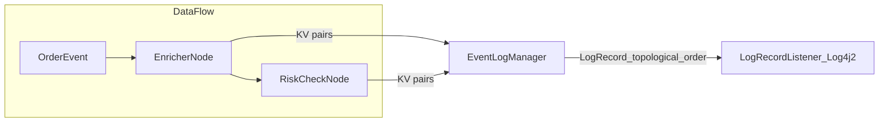

# Audit Logging Demo

This sample demonstrates structured audit logging with Fluxtion’s EventLogger. It shows how nodes log key/value pairs that are aggregated into a per-node LogRecord by the EventLogManager, and how these records are emitted in topological order to show the execution path through the graph.

What you will learn:

- How a node becomes an EventLogSource and receives an injected EventLogger
- Structured, machine- and human-readable log records (KV pairs per node)
- Topological ordering of log records and end-to-end tracing
- Configuring the runtime logging pipeline (LogRecordListener) with Log4j2
- Tracing versus logging (trace produces a record per node visited)
- Zero-GC logging model (LogRecord buffers are reused per event)
- How to build using an AOT graph builder (imperative registration) and run the demo

## Project layout

- [EnricherNode.java](src/main/java/com/telamin/fluxtion/example/sampleapps/audit/EnricherNode.java)
- [RiskCheckNode.java](src/main/java/com/telamin/fluxtion/example/sampleapps/audit/RiskCheckNode.java)
- [FailWhenIdNode.java](src/main/java/com/telamin/fluxtion/example/sampleapps/audit/FailWhenIdNode.java)
- [AuditLoggingDemoRunner.java](src/main/java/com/telamin/fluxtion/example/sampleapps/audit/AuditLoggingDemoRunner.java)
- [AuditLoggingAOTGraphBuilder.java](src/main/java/com/telamin/fluxtion/example/sampleapps/audit/AuditLoggingAOTGraphBuilder.java)
- [log4j2.yaml](src/main/resources/log4j2.yaml)
- [start.sh](start.sh) / [stop.sh](stop.sh)

## Structured logging concepts

- Nodes that implement EventLogSource (or extend EventLogNode/NamedBaseNode) are injected with an EventLogger during init.
- Each node writes key/value pairs to its EventLogger during event handling; the EventLogManager aggregates these values into a structured LogRecord keyed by node name.
- The node name used in the LogRecord is the same as the variable name of the node in the generated AOT code (stable identifier).
- Records are emitted in topological order, reflecting the execution path. The structure shows the path; each node’s content shows the detail.
- Configure logging behaviour at build time with EventProcessorConfig.addEventAudit(...) and at runtime with DataFlow#setAuditXXXX methods (see DataFlow#setAuditLogProcessor, setAuditLogLevel, setAuditTimeFormatter, etc.).

Mermaid sketch of dataflow and logging path:



Zero-GC note: The logging framework reuses LogRecord buffers per event process cycle. After processing completes, the buffers are reset and recycled. This eliminates per-event allocations for logging.

## Code snippets

Enricher node writing KV pairs:

```java
public class EnricherNode extends NamedBaseNode {
    public EnrichedOrder enrich(OrderEvent order) {
        double notional = order.qty() * order.price();
        auditLog.info("event", order.toString())
                .debug("calc", "enrich")
                .info("symbol", order.symbol())
                .info("qty", String.valueOf(order.qty()))
                .info("price", String.valueOf(order.price()))
                .info("notional", String.valueOf(notional));
        return new EnrichedOrder(order, notional);
    }
}
```

Attaching a LogRecordListener (Log4j2 backend via JUL bridge) at runtime:

```java
DataFlow df = ... // built via AOT builder below
// Emit records via JUL; log4j-jul + log4j2.yaml handle the backend
df.setAuditLogProcessor(new JULLogRecordListener());
// Optional: customize timestamp format used in records
ObjLongConsumer<StringBuilder> isoFormatter = (sb, epochMicros) ->
        sb.append(DateTimeFormatter.ISO_OFFSET_DATE_TIME
                .format(Instant.ofEpochMilli(epochMicros / 1_000)
                        .atZone(ZoneId.systemDefault())));
df.setAuditTimeFormatter(isoFormatter);
```

Tracing vs logging:

- Logging at INFO/DEBUG/WARN/ERROR only produces records for nodes that actually log KV pairs (via EventLogger.info/debug/etc.).
- Tracing at TRACE produces a record for every node visited in the execution cycle, even if that node did not write any KV pairs.
- Switch level at runtime:

```java
df.setAuditLogLevel(EventLogControlEvent.LogLevel.TRACE);
```

## AOT: Imperative builder usage (generation moved to builder)

Do not use the functional DataFlow API for AOT graph builders. Instead, register nodes and auditors imperatively in the builder. Generation of the DataFlow has been moved to [AuditLoggingAOTGraphBuilder.java](src/main/java/com/telamin/fluxtion/example/sampleapps/audit/AuditLoggingAOTGraphBuilder.java).

Builder excerpt:

```java
public class AuditLoggingAOTGraphBuilder implements FluxtionGraphBuilder {
  @Override
  public void buildGraph(EventProcessorConfig processorConfig) {
    processorConfig.addNode(new EnricherNode());
    processorConfig.addNode(new RiskCheckNode());
    processorConfig.addNode(new FailWhenIdNode("FAIL"));
    processorConfig.addEventAudit(EventLogControlEvent.LogLevel.INFO);
  }
  @Override
  public void configureGeneration(FluxtionCompilerConfig cfg) {
    cfg.setClassName("AuditLoggingProcessor");
    cfg.setPackageName("com.telamin.fluxtion.example.sampleapps.audit.generated");
  }
}
```

Runtime runner now just instantiates the generated class and drives events:

```java
DataFlow df = new com.telamin.fluxtion.example.sampleapps.audit.generated.AuditLoggingProcessor();
// set JULLogRecordListener + optional time formatter
// set TRACE level if you want per-node traversal
// send events, wrapping in try/catch (see next section)
```

### Failure and recovery logging (getLastAuditLogRecord)

We add a small node [FailWhenIdNode](src/main/java/com/telamin/fluxtion/example/sampleapps/audit/FailWhenIdNode.java) that deliberately throws for a particular OrderEvent id ("FAIL"). In the DemoRunner we wrap df.onEvent(...) in try/catch. If an exception occurs, we print df.getLastAuditLogRecord(), which returns the last partial structured record collected so far. This is useful for diagnosing failures mid-cycle without separate tracing.

Snippet from the DemoRunner:

```java
try {
    df.onEvent(new OrderEvent("FAIL", "TSLA", 1, 1000.00));
} catch (Throwable e) {
    System.err.println("Exception processing FAIL: " + e);
    System.err.println("Last audit record (partial):\n" + df.getLastAuditLogRecord());
}
```

## Actual output (from running ./start.sh)

Captured on our run (values will vary):

```
10:09:59.517 [main] INFO  com.telamin.fluxtion.runtime.audit.EventLogManager - updating event log config:EventLogConfig{level=TRACE, logRecordProcessor=null, sourceId=null, groupId=null}
Exception processing FAIL: java.lang.RuntimeException: Simulated processing failure for order id=FAIL
Last audit record (partial):
eventLogRecord:
    eventTime: 1970-01-21T09:54:47.399+01:00
    logTime: 1970-01-21T09:54:47.399+01:00
    groupingId: null
    event: OrderEvent
    eventToString: OrderEvent{id='FAIL', symbol='TSLA', qty=1, price=1000.0}
    nodeLogs:
        - enricherNode_0: { thread: main, method: onOrder, event: OrderEvent{id='FAIL', symbol='TSLA', qty=1, price=1000.0}, calc: enrich, symbol: TSLA, qty: 1, price: 1000.0, notional: 1000.0}
        - failWhenIdNode_2: { thread: main, method: onOrder, calc: fail-check, orderId: FAIL, failure: triggering simulated exception
```

## Run

From this module directory:

```
./start.sh
```

Or via Maven:

```
mvn -q -DskipTests exec:java -Dexec.mainClass=com.telamin.fluxtion.example.sampleapps.audit.AuditLoggingDemoRunner \
  -Dlog4j.configurationFile=src/main/resources/log4j2.yaml \
  -Djava.util.logging.manager=org.apache.logging.log4j.jul.LogManager
```

## References

- Examples of audit logging: fluxtion-compiler/fluxtion-full-compiler/src/test/java/com/fluxtion/dataflow/node/audit
- Runtime configuration methods: com.telamin.fluxtion.runtime.DataFlow#setAuditXXXXXX
- EventLogger, EventLogSource, LogRecord, LogRecordListener APIs
