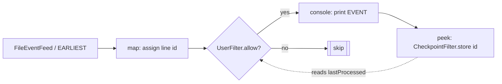

Stateful Checkpoint Demo

Overview

- This sample demonstrates how to manage state in a Fluxtion application by using a "user" class and a simple service to
  persist a checkpoint to disk.
- Fluxtion dataflows are stateless graphs by design. Any state you need (such as offsets, checkpoints, or aggregated
  values) should be managed by user-provided classes and services.

What this app does

- Reads lines from a text file using FileEventFeed.
- Adds a sequential id (line number) to each line inside the pipeline.
- Uses a UserFilter that consults a CheckpointFilter to skip lines that have already been processed in previous runs.
- Prints the accepted events to the console.
- Persists the last processed id (line number) to a checkpoint file so that restarts continue where the previous run
  left off.
- On start, the app also generates a new line every 5 seconds to the input file so you can immediately see data moving
  through the pipeline without additional tools.

Key classes

- [StateCheckpointDemo.java](src/main/java/com/telamin/fluxtion/example/sampleapps/state/StateCheckpointDemo.java): wires the dataflow using DataFlowConnector and runs the app.
- [CheckpointFilter.java](src/main/java/com/telamin/fluxtion/example/sampleapps/state/CheckpointFilter.java): a stateful service that reads/writes the last processed line number to a text file.
- [UserFilter.java](src/main/java/com/telamin/fluxtion/example/sampleapps/state/UserFilter.java): acts as a filter in the pipeline; it checks the checkpoint and allows only events with id greater than the
  stored checkpoint.
- [LineEvent.java](src/main/java/com/telamin/fluxtion/example/sampleapps/state/LineEvent.java): immutable POJO carrying id (line number) and line text.
- [DemoFileGenerator.java](src/main/java/com/telamin/fluxtion/example/sampleapps/state/DemoFileGenerator.java): utility that appends a line to the input file every 3 seconds (can be replaced with your own
  producer).

Why this demonstrates state management in Fluxtion

- The Fluxtion graph (the dataflow) itself is stateless; it simply wires sources, operators, and sinks.
- The CheckpointFilter and UserFilter are ordinary user classes. They encapsulate state and persistence policy outside
  the graph.
- This separation makes it easy to test and reason about your state: Fluxtion focuses on scheduling and dispatch; you
  focus on what state to keep and how to persist it.

Behavior when deleting the checkpoint file

- If you remove the checkpoint file and restart the app, the pipeline will start from the beginning (id 1), because the
  checkpoint cannot be found and defaults to 0.

Project layout

- src/main/java/com/telamin/fluxtion/example/sampleapps/state
    - StateCheckpointDemo.java
    - CheckpointFilter.java
    - UserFilter.java
    - LineEvent.java
    - DemoFileGenerator.java
- data
    - input.txt (the input file; lines are appended at runtime)
    - checkpoint.txt (created at runtime next to the data folder if you use the default path)

Build and run
From the repository root:

1) Build just this module (and any required dependencies):
   mvn -q -pl sample-apps/state-checkpoint-demo -am package

2) Run with exec plugin (default paths):
   mvn -q -pl sample-apps/state-checkpoint-demo exec:exec

3) Or run the shaded jar:
   java --add-opens=java.base/jdk.internal.misc=ALL-UNNAMED -jar
   sample-apps/state-checkpoint-demo/target/state-checkpoint-demo-*-jar-with-dependencies.jar

4) Optionally pass custom paths for input and checkpoint files:
   mvn -q -pl sample-apps/state-checkpoint-demo exec:exec -Dexec.args="./data/myInput.txt ./data/myCheckpoint.txt"

Observing the demo

- When the app starts, it will begin appending a new line to the input file every 3 seconds. You should see the console
  print messages for each new line.
- Stop the app and restart it: it will resume from the next id after the last printed one, because the CheckpointFilter
  persisted the id.
- Delete the checkpoint file and restart: the app will start from the beginning again (printing from id 1).

Notes

- This sample uses DataFlowConnector as in other sample-apps to wire the FileEventFeed to the DataFlow graph and start
  the runtime.
- The checkpoint file is a single integer in a text file. For production use, you could swap this for a more robust
  persistence mechanism (database, durable KV store, etc.).


Mermaid: Dataflow overview



Sample output

The console prints each accepted event with its id and text. Example:

```
EVENT: LineEvent[id=1, line=Generated @ 2025-10-09T07:26:01.234]
EVENT: LineEvent[id=2, line=Generated @ 2025-10-09T07:26:04.236]
EVENT: LineEvent[id=3, line=Generated @ 2025-10-09T07:26:07.239]
...
```

After stopping and restarting (without deleting the checkpoint), the app resumes from the next id:

```
EVENT: LineEvent[id=4, line=Generated @ 2025-10-09T07:28:12.101]
EVENT: LineEvent[id=5, line=Generated @ 2025-10-09T07:28:15.104]
```

If you delete `./data/checkpoint.txt` and restart, it starts again from id 1.
